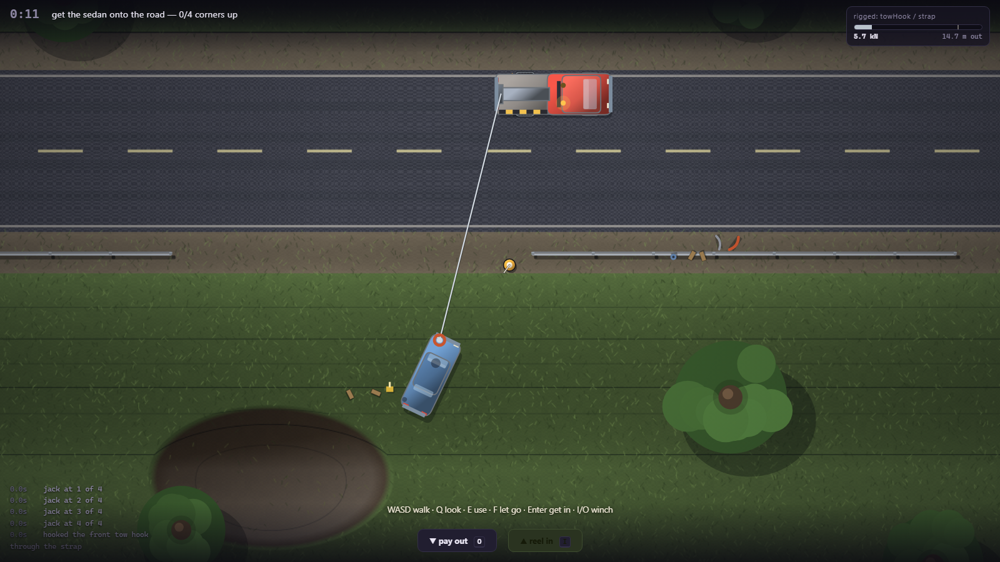

# TOW BROS

A cooperative, physics-led vehicle recovery game. A sedan is nose-down on a wet grassy
embankment; a tow truck is on the road; nothing tells you how to connect the two.

**Milestone 1 — One Vehicle, One Ditch, One Recovery — is playable.** Browser, Canvas 2D,
ES modules, zero dependencies, zero external requests.

The design contract is [GDD.md](GDD.md), and it is in this repo on purpose: the code answers to
it, not the other way round.



## Play it

```bash
cd C:\Dev\TowBros && .\play.bat
```

That serves the game over http and opens a tab. **It cannot be opened from disk** — ES modules
are blocked on `file://`, and the page will tell you so if you try.

| | |
|---|---|
| `WASD` / arrows | walk on foot, drive in the seat. One set of keys, two readings. |
| `E` | use whatever is in front of you: take the hook, hook it on, wrap a strap, place a block, pump the jack, run the line through the snatch block, drop the casualty's handbrake |
| `Q` | look at something. Tells you facts, never what to do |
| `F` | let go — unhook the line, or put down what you are carrying |
| `Enter` | get in and out of the truck |
| `I` / `O` | winch in and out. Works on foot, in the cab, and while everything is going wrong |
| `Space` | parking brake |
| `-` / `=` | zoom · `R` `R` reset · `Esc` pause · `F3` developer overlay |

## What Milestone 1 is

One situation, and no authored solution to it. The objective is *get the sedan onto the road* —
all four corners on pavement, settled. How is entirely yours.

**Where you park changes the job, and every park can finish it.** A winch pulls its load *to the
drum*, so the drum needs about 3 m of pavement south of it for the car to have somewhere to land.
From the northern two thirds of the 9.4 m road, winching alone does it.

From the last third it cannot — measured over fourteen parks, the car always ends up against your
own truck. So that job finishes the way a real one would: the winch gets it up the bank, you walk
over and **drop the casualty's handbrake**, and you tow it clear. A rolling car tows out in about
half the time a braked one does. Flooring it parts the cable.

Releasing that brake cuts both ways, which is the point of having it. On the bank the downhill pull
is ~6 kN against ~1.2 kN of rolling resistance, so a car let loose in the wrong place runs away
downhill — into the mud, if that is what is below it. Chock it first, or hold it on the line. The
chocks are in the pile.

Four approaches are verified to work, and they are not variations on one:

- **Straight pull from the pavement.** Park the wrecker along the road with its tail to the job,
  hook the tow eye, reel. About 37 seconds and 13 kN of line tension, and nothing breaks.
- **Brute force, then re-rig.** Hook the bumper instead. It tears off at 9 kN and becomes an
  object lying in the grass. The job carries on; chain the frame and finish it.
- **Side pull through a snatch block.** Mount the block on the tree at the foot of the bank and
  route the line through it. The pull now runs along the contour instead of up it, which turns
  the car rather than dragging it. Take the line back out and pull straight to finish.
- **The careful one.** Cribbing under the sedan, the jack wound out, chocks behind the truck's
  rear wheels. Finishes on 9.8 kN instead of 11.2 — the equipment is not decoration.

And one outcome the GDD asks for explicitly, which is not a failure state: park the wrecker on
the wet bank instead of the road and **the truck loses**. Same rig, same winch, same car. It
slides 9 metres down the slope while the sedan barely moves, the log says so, and you carry on
from wherever everything ended up.

## How it works

The whole design rests on three mechanisms.

**A real height field, in a top-down game.** [`src/data/terrain.js`](src/data/terrain.js) carries
`h(x,y)` in metres. In-plane gravity is `-m·g·∇h/√(1+|∇h|²)` and the normal load scales by
`1/√(1+|∇h|²)` — so a vehicle parked across the embankment gains a downhill pull and loses grip
at the same time, in the right proportion, without either being special-cased. The renderer draws
its contour lines from that same function, which is the only reason a player can read a slope on
a flat screen.

**One tension, applied twice.** [`src/recovery/cable.js`](src/recovery/cable.js) resolves a
damped spring along the cable route and applies it equal-and-opposite at two physical offsets —
the fairlead on the truck's tail and the attachment point on the car. Both ends get torque.
Nothing anywhere asks which one is the load.

**Static friction.** [`src/sim/tires.js`](src/sim/tires.js) sizes each wheel's resistance against
the force *already in the accumulator*, so a load below the available grip produces no movement at
all. That one detail is the difference between a car that sits there while the line goes
bar-tight, and a car that creeps out of a ditch under any tension you like.

```
src/
  config.js          every tunable number, and the force budget they form
  game.js            authoritative state; the fixed step; the order forces are applied in
  core/              clock, seeded RNG, event bus, input, planar vector maths
  data/              terrain, vehicles + attachment zones, equipment  (all pure data)
  sim/               rigid body, tire model, vehicle step, contacts
  recovery/          the winch line, attachment failure and debris, equipment effects
  world/scene.js     scene assembly, the one objective, and the recap
  player/player.js   walking, driving, and the context-key priority chain
  render/            camera, canvas renderer, synthesised audio
  ui/hud.js          tension gauge, context prompt, job log, inspect card
tools/               dev server, headless test harness, screenshot harness
```

Read the top of `src/config.js` before changing any number in it. The interesting decisions in
this game exist because of how those numbers compare, and the comparison is written down there.

## Tests

```bash
.\tools\smoketest.ps1
```

258 assertions in headless Chrome. There is no Node.js on this machine, so the harness *is* a
browser: it injects [`tools/m1-tests.js`](tools/m1-tests.js) into a copy of the page, serves it,
and greps the dumped DOM.

Sections A–G test the machinery numerically. Section H drives **whole recoveries** and checks the
GDD's nine completion criteria one at a time — including that two runs of one seed are identical,
that six attempts produce six different layouts, and that at least three meaningfully different
approaches work. Section Hk sweeps a grid of parking positions across the road and asserts both
halves of the claim above: the northern two thirds recover the car on the winch, the last third
finishes with a tow, and **no** park anywhere on the road costs you the cable. Section J presses
keys, because a player cannot call `attachHook()` — and it is the section that found the worst bug
in the project.

Every live test drives `game.skipMs()` rather than waiting for frames. Headless Chrome in
`--dump-dom` mode delivers one to three `requestAnimationFrame` callbacks in total — measured, and
recorded in `Dev\INDEX.md`. A test that waits for a frame count waits forever.

`.\tools\shot.ps1 -Setup tools\_shot-rigged.js -Out docs\m1-rigged.png` poses the real game
mid-recovery and screenshots it.

## Reuse

Per `Dev\INDEX.md`, these were copied and adapted rather than rewritten: `GameClock`, `Rng` /
`mulberry32`, `EventBus`, `Input` and `Camera` from **Airport Baggage Crew**, along with its
headless-Chrome harness, dev server and screenshot tool; `tone()` from **Chameleon**. Names were
kept so the lineage stays greppable.

New here, and worth taking for the next project: the planar rigid body with force-at-a-point
(`sim/body.js`), the friction-circle tire model with static resistance (`sim/tires.js`), the
height field with hypsometric contour rendering (`data/terrain.js` + `render/renderer.js`), and
the damped two-body cable constraint (`recovery/cable.js`).

## Known limitations

- Must be served over http. `play.bat` does it.
- Single player. Networking is Milestone 2 — see GDD §7.
- The recovered vehicle cannot be occupied — no steering it, no braking it from inside. Milestone 2.
  Reaching in through the door to drop its handbrake is not that, and is in.
- No economy, payout, transport, garage or dispatch. GDD §8 defers all of it, and the empty
  boundaries in `config.js` say so rather than half-implementing them.
- Contacts are single-point impulses with no stacking. Deliberate: see the note at the top of
  `sim/collision.js`.
