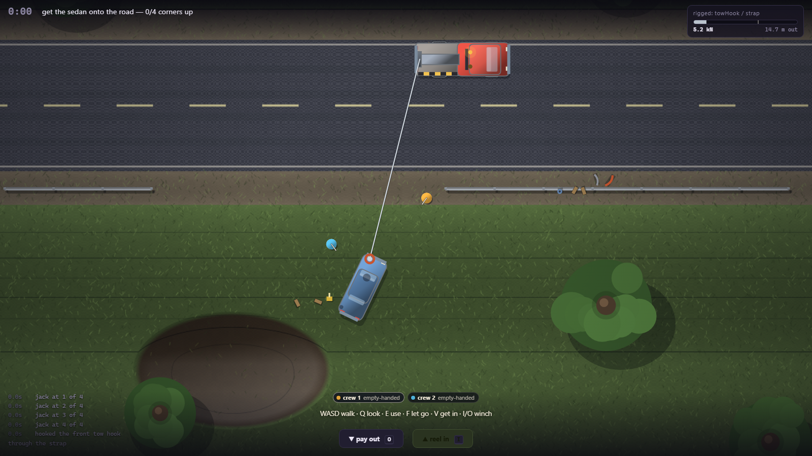

# TOW BROS

A cooperative, physics-led vehicle recovery game. A sedan is nose-down on a wet grassy
embankment; a tow truck is on the road; nothing tells you how to connect the two.

**Milestone 2 — a crew, not a player — is playable, over a network.** Two to four people on one
site, one winch hook between them. Browser, Canvas 2D, ES modules, zero dependencies, and still
zero external requests — including the multiplayer.

The design contract is [GDD.md](GDD.md), and it is in this repo on purpose: the code answers to
it, not the other way round.



## Play it

```bash
.\play.bat
```

That serves the game over http and opens a tab. **It cannot be opened from disk** — ES modules
are blocked on `file://`, and the page will tell you so if you try.

Three ways to bring somebody, all on the title screen and none of them involving a server:

| | |
|---|---|
| **one keyboard** | just start the job. Two hand positions, mirrored, no shared keys — the table below |
| **two tabs** | press "open a second tab", then open the page again and press it there too |
| **two machines** | one presses "host over the network" and sends the blob; the other presses "join somebody" and pastes it, then sends the reply back. Same LAN |

Two people, one keyboard. Mirrored hand positions, no shared keys.

| | crew 1 | crew 2 |
|---|---|---|
| walk / drive | `W` `A` `S` `D` | `↑` `←` `↓` `→` |
| use what is in front of you | `E` | `/` |
| look at something | `Q` | `.` |
| let go | `F` | `,` |
| get in and out | `V` | `right shift` |
| parking brake | `space` | `\` |
| winch in / out | `I` `O` | `]` `[` |

`-` `=` zoom · `R` `R` reset · `Esc` pause · `F3` developer overlay. Those are shared, because
they are about the screen rather than about a person.

`E` (or `/`) is the whole verb set: take the hook, hook it on, wrap a strap, place a block, pump the
jack, run the line through the snatch block, drop the casualty's handbrake. What it does is decided
by what you are standing next to.

## What Milestone 2 is

Milestone 1 was one person and one ditch. This is two to four people and the same ditch, which
turns out to be a different game — because there is exactly **one** winch hook, one jack, one
snatch block and two seats, and everybody wants them at once.

**Ownership lives on the object, never in a side table.** `winch.heldBy`, `item.carriedBy`,
`vehicle.occupiedBy` — three fields, and nowhere else to look, so there is nothing to desync.
Every claim is a guarded transition on one of them (`src/crew/authority.js`). Two crew pressing
`E` at the drum in the same simulation step produce exactly one holder and one refusal, and the
refusal says who beat you to it rather than silently doing nothing.

**One drum, several hands.** The winch is reachable by anyone at any time — GDD §5 — so two people
can fight over it. When one reels in while the other pays out, the drum stops and the HUD says
`TWO HANDS ON THE DRUM`. It does not pick a winner. A silently-resolved conflict is worse than a
stopped winch, because you cannot see it.

**The casualty has a seat.** Somebody can sit in the car being recovered and steer it while it is
dragged. It has no engine — flooring it does nothing, measured against the same roll with the
throttle up: 2.77 m either way, all of it gravity — but the front wheels turn, and pointing them
changes where the car ends up. Measured on the standard far-lane pull over 20 seconds: straight,
the car travels 5.41 m and climbs 3.91; on full right lock it travels 7.55 m and climbs 3.29. You
trade climb for lateral travel, which is exactly the choice a real recovery operator makes.

**Getting knocked down is punctuation.** Walk in front of a moving vehicle and you go over: a
couple of seconds on the ground, and **whatever was in your hands lands on the ground with you**.
That last part is the mechanically important one — a crew member flattened while holding the hook
releases their claim, so the hook is never stranded on somebody who is face-down. A parked truck you
just bump into.

**Everything runs through the command seam.** GDD §6 asks for multiplayer authority to sit above
"deterministic-ish simulation commands", so it does: every seat — including the keyboard in front of
you — is driven by a two-mask command frame (`held`, `pressed`) sampled inside the fixed step and
delivered through a transport (`src/net/commands.js`). Four bytes per seat per step. The frames
carry intent, never state, so the seeded fixed-step simulation stays authoritative on every machine.

**And it goes over a wire, with no server anywhere.** The netcode is lockstep: every peer runs the
same steps from the same seed with the same commands and arrives at the same world, so there is no
authority, no reconciliation, and no snapshots of a 6.8-tonne truck being smeared across three
frames. The price is that nobody may step until every seat's commands for that step have arrived,
paid with four steps (67 ms) of input delay rather than with prediction.

Two transports, both serverless:

- **Two tabs of one browser**, over BroadcastChannel. Zero network. Open the page twice.
- **Two machines**, over WebRTC, with the signalling done by the players: one copies about a
  thousand characters of base64 and sends it however they already talk, and the other pastes it
  back. There are no ICE servers by default, so only host candidates are gathered and the pair must
  be on the same network. Crossing a NAT needs a STUN server, which is an external request — so it
  is an argument you can have, not a default that spends the project's one hard rule quietly.

The proof is `tools/m2-tests.js` §R: two complete simulations in one page, wired together by a real
BroadcastChannel and driven from two keyboards. **286 steps compared one at a time — including 220
with a loaded cable, and a network outage in the middle — and zero disagreements.**


Everything Milestone 1 could do, it still does, at the same numbers: far lane recovers on the winch
in 36 s at 12 kN, the rest of the road stalls legibly and finishes with a tow in 40–45 s, no park
anywhere on the road costs you the cable, four genuinely different approaches work.

## How it works

The whole design rests on four mechanisms.

**A real height field, in a top-down game.** [`src/data/terrain.js`](src/data/terrain.js) carries
`h(x,y)` in metres. In-plane gravity is `-m·g·∇h/√(1+|∇h|²)` and the normal load scales by
`1/√(1+|∇h|²)` — so a vehicle parked across the embankment gains a downhill pull and loses grip
at the same time, in the right proportion, without either being special-cased. The renderer draws
its contour lines from that same function, which is the only reason a player can read a slope on
a flat screen.

**One tension, applied twice.** [`src/recovery/cable.js`](src/recovery/cable.js) resolves a
damped spring along the cable route and applies it equal-and-opposite at two physical offsets —
the fairlead on the truck's tail and the attachment point on the car. Both ends get torque.
Nothing anywhere asks which one is the load.

**Static friction.** [`src/sim/tires.js`](src/sim/tires.js) sizes each wheel's resistance against
the force *already in the accumulator*, so a load below the available grip produces no movement at
all. That one detail is the difference between a car that sits there while the line goes
bar-tight, and a car that creeps out of a ditch under any tension you like.

**Lockstep, not authority.** [`src/net/session.js`](src/net/session.js) gates the fixed step on
every seat's commands for that step having arrived, and sends nothing else. That is only possible
because the simulation is seeded and deterministic — which the M1 suite already proved before the
netcode existed — and it is why a networked game and a solo one are the same code.

**Ownership on the object.** [`src/crew/authority.js`](src/crew/authority.js) keeps who-has-what in
three fields on the three objects — `winch.heldBy`, `item.carriedBy`, `vehicle.occupiedBy` — rather
than in a parallel table of owners. Two records of one fact eventually disagree, and the
disagreement is invisible until something reads the stale half. `validateAuthority()` runs in the
F3 overlay every frame as well as in the tests, because an authority bug is far easier to see live
than to reconstruct from a trace afterwards.

```
src/
  config.js          every tunable number, and the force budget they form
  game.js            authoritative state; the fixed step; the order forces are applied in
  core/              clock, seeded RNG, event bus, input, planar vector maths
  data/              terrain, vehicles + attachment zones, equipment  (all pure data)
  sim/               rigid body, tire model, vehicle step, contacts
  recovery/          the winch line, attachment failure and debris, equipment effects
  world/scene.js     scene assembly, the one objective, and the recap
  player/player.js   the crew: walking, driving, and the context-key priority chain
  crew/authority.js  who owns the hook, the gear and the seats — and nothing else does
  net/               the command frame, the lockstep scheduler, and two serverless transports
  render/            camera, canvas renderer, synthesised audio
  ui/hud.js          tension gauge, context prompt, job log, inspect card
tools/               dev server, headless test harness, screenshot harness
```

Read the top of `src/config.js` before changing any number in it. The interesting decisions in
this game exist because of how those numbers compare, and the comparison is written down there.

## Tests

```bash
.\tools\smoketest.ps1
```

```bash
.\tools\smoketest.ps1 -Tests tools\m2-tests.js
```

**483 assertions** across two suites in headless Chrome — 264 for Milestone 1, 219 for Milestone 2.
There is no Node.js on this machine, so the harness *is* a browser: it injects the suite into a copy
of the page, serves it over http, and greps the dumped DOM.

[`tools/m1-tests.js`](tools/m1-tests.js) — sections A–G test the machinery numerically. Section H
drives **whole recoveries** and checks the GDD's nine completion criteria one at a time, including
that two runs of one seed are identical, that six attempts produce six different layouts, and that
at least three meaningfully different approaches work. Section Hk sweeps a grid of parking positions
across the road: the far lane recovers on the winch, the rest of the road finishes with a tow, and
**no** park anywhere on the road costs you the cable. Section J presses keys, because a player
cannot call `attachHook()` — and it is the section that found the worst bug in the project.

[`tools/m2-tests.js`](tools/m2-tests.js) — section K hammers the claim/release pairs directly:
two actors on one hook, one item, one seat; `releaseAll` after a disconnect; and every way
`validateAuthority` is supposed to catch a broken graph. Section L does the same thing *through two
real keyboards in the same simulation step*, which is the only way to test a genuine race. Section M
is the stumble, and mostly asserts that a knocked-down crew member cannot strand a claim. Section N
is the occupiable casualty. Section Q is the command seam, and its load-bearing assertion is Q21: a
crew driven entirely through command frames ends up at **exactly** the coordinates the keyboard put
them, to six decimal places.

Section R is the lockstep proof, and the strongest test in the project: two whole Games in one
headless page, connected by a real BroadcastChannel, each driving its own seat from its own
keyboard. Every step either side runs is recorded against its step number, and every step both
machines ran is compared. 286 of them — including 220 with a loaded cable and a deliberate network
outage in the middle — and none of them disagreed.

Every live test drives `game.step()` / `game.skipMs()` rather than waiting for frames. Headless
Chrome in `--dump-dom` mode delivers one to three `requestAnimationFrame` callbacks in total —
measured, and recorded in `Dev\INDEX.md`. A test that waits for a frame count waits forever.

`.\tools\shot.ps1 -Setup tools\_shot-rigged.js -Out docs\m2-crew.png` poses the real game
mid-recovery and screenshots it.
## Reuse

Per `Dev\INDEX.md`, these were copied and adapted rather than rewritten: `GameClock`, `Rng` /
`mulberry32`, `EventBus`, `Input` and `Camera` from **Airport Baggage Crew**, along with its
headless-Chrome harness, dev server and screenshot tool; `tone()` from **Chameleon**. Names were
kept so the lineage stays greppable.

New here, and worth taking for the next project: the planar rigid body with force-at-a-point
(`sim/body.js`), the friction-circle tire model with static resistance (`sim/tires.js`), the
height field with hypsometric contour rendering (`data/terrain.js` + `render/renderer.js`), the
damped two-body cable constraint (`recovery/cable.js`), the ownership-on-the-object authority layer
(`crew/authority.js`), and the command-frame seam with its delay-capable loopback transport
(`net/commands.js`) — the last two are the reusable half of local co-op and belong in anything
where more than one person can grab the same thing.

## Known limitations

- Must be served over http. `play.bat` does it.
- **Same network only, over WebRTC.** No ICE servers are configured, so only host candidates are
  gathered: two machines on one LAN or VPN connect, two behind different NATs do not. Crossing a NAT
  needs a STUN server, which is an external request and therefore a deliberate decision rather than
  a silent default. Pass `iceServers` to `ManualWebRtcPeer` if you want to spend it.
- **The handshake is copy-and-paste.** No lobby, no matchmaking, no room codes, because all three
  are somebody else's server. It is clunky exactly once per session.
- **A network outage longer than about 400 ms stops the game rather than desyncing it.** Loss
  recovery is a 24-frame redundancy window and nothing else — no acks, no retransmit requests, no
  resync. That is the honest failure mode for lockstep: it halts visibly instead of quietly
  drifting into two different worlds.
- Seats 3 and 4 exist and are drivable by command frames but have no keyboard bindings — two hand
  positions is all one keyboard has room for. Over the wire each machine drives one seat, so three
  and four players work; four on one keyboard does not.
- No economy, payout, transport, garage or dispatch. GDD §8 defers all of it, and the empty
  boundaries in `config.js` say so rather than half-implementing them.
- Contacts are single-point impulses with no stacking. Deliberate: see the note at the top of
  `sim/collision.js`.
