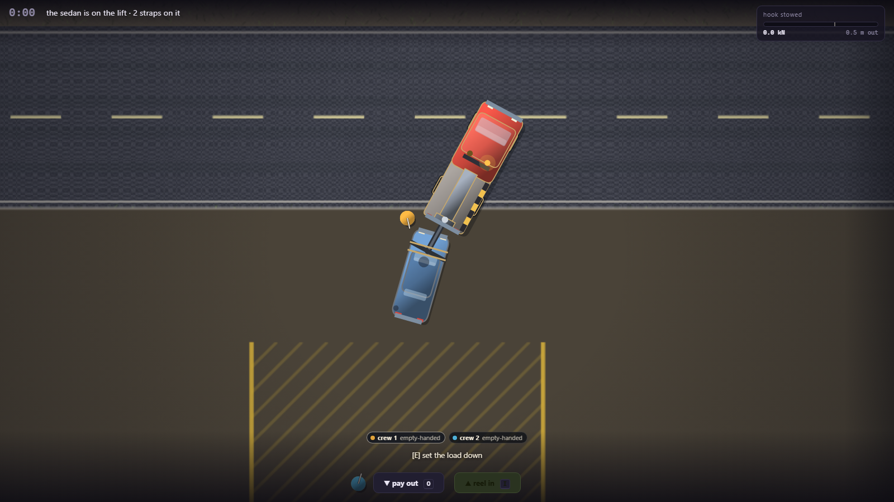
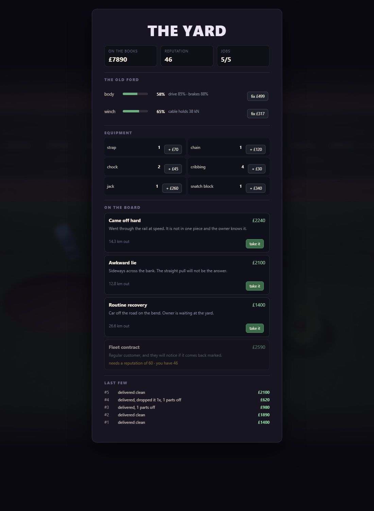
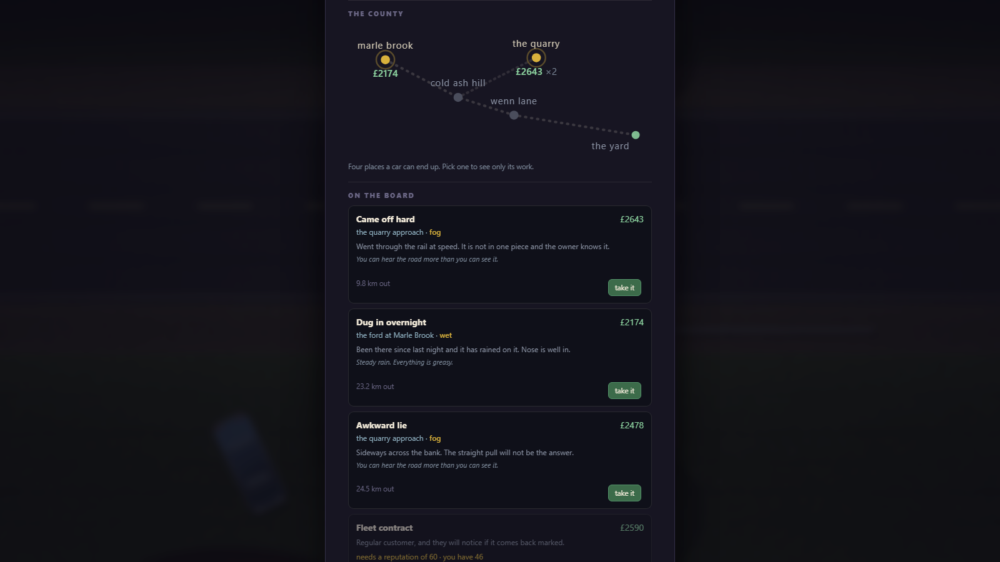
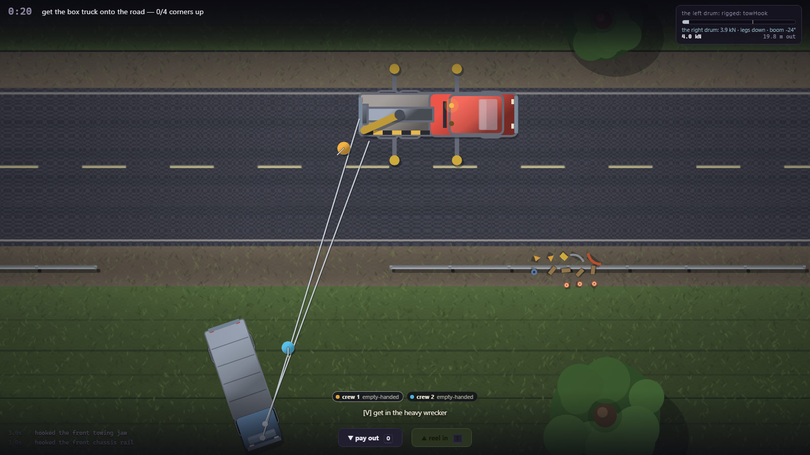
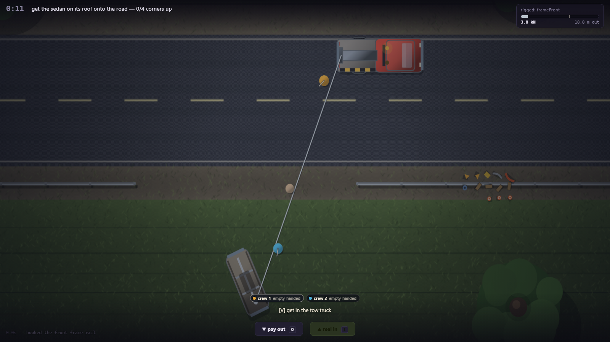
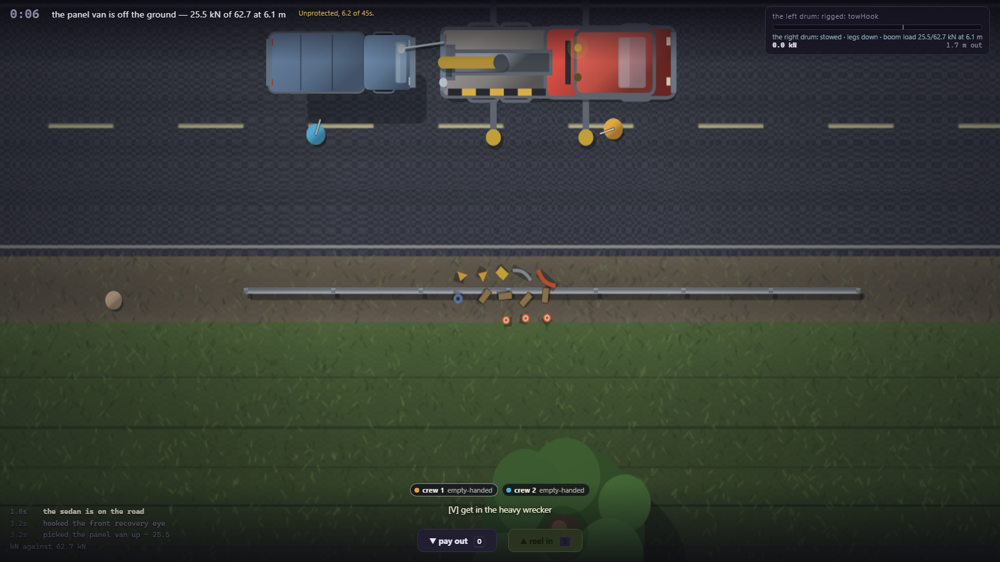
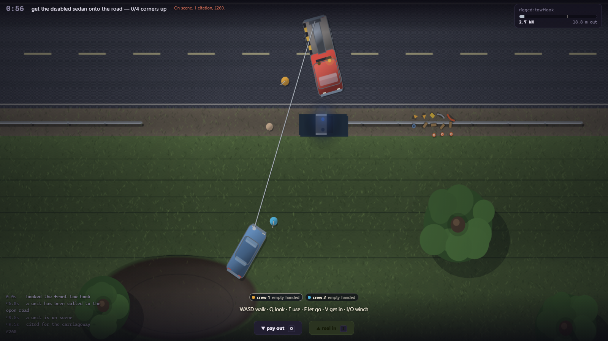

# TOW BROS

A cooperative, physics-led vehicle recovery game. A sedan is nose-down on a wet grassy
embankment; a tow truck is on the road; nothing tells you how to connect the two.

**Milestone 8 — what the machine can actually lift — is playable.** Pick a job off the board — a
place, a forecast, a fee, and what is off the road — winch it out of the ditch while its owner
watches from the verge, or put the rotator on its legs and pick it up off the ground outright, then
carry it home on the underlift through a tailback of live traffic, reverse it into the bay, and get
paid what the damage left of the fee — less whatever you were cited for leaving the road open. Then
fix the truck, save up for a bigger one, and watch the afternoon go: a careful morning means the
second job is in falling light.
Two to four people, over a network if you like. Browser, Canvas 2D, ES modules, zero dependencies,
and still zero external requests — including the multiplayer and the save file.

The design contract is [GDD.md](GDD.md), and it is in this repo on purpose: the code answers to
it, not the other way round.













## Play it

```bash
.\play.bat
```

That serves the game over http and opens a tab. **It cannot be opened from disk** — ES modules
are blocked on `file://`, and the page will tell you so if you try.

The title card leads to **the yard**, which is where the company lives: what is in the bank, what
state the truck is in, what is in the equipment cupboard, and three jobs on the board. Take one and
it starts. `G` gets you back there from a job; the company saves itself as you go.

Three ways to bring somebody, all on the title screen and none of them involving a server:

| | |
|---|---|
| **one keyboard** | just take a job. Two hand positions, mirrored, no shared keys — the table below |
| **two tabs** | press "open a second tab", then open the page again and press it there too |
| **two machines** | one presses "host over the network" and sends the blob; the other presses "join somebody" and pastes it, then sends the reply back. Same LAN |

Two people, one keyboard. Mirrored hand positions, no shared keys.

| | crew 1 | crew 2 |
|---|---|---|
| walk / drive | `W` `A` `S` `D` | `↑` `←` `↓` `→` |
| use what is in front of you | `E` | `/` |
| look at something | `Q` | `.` |
| let go | `F` | `,` |
| get in and out | `V` | `right shift` |
| parking brake | `space` | `\` |
| winch in / out | `I` `O` | `]` `[` |
| slew the boom | `Z` `C` | `;` `'` |
| outriggers up / down | `X` | `L` |

The last two only do anything on the heavy wrecker. They are machine controls, on the same tier as
the drum keys — they operate a thing, rather than deciding what the one context key means.

`-` `=` zoom · `R` `R` restart the job · `G` the yard · `Esc` pause · `F3` developer overlay. Those
are shared, because they are about the screen rather than about a person.

`E` (or `/`) is the whole verb set: take the hook, hook it on, wrap a strap, place a block, pump the
jack, run the line through the snatch block, drop the casualty's handbrake. What it does is decided
by what you are standing next to.

## What Milestone 8 is

What the machine can actually lift. The GDD's roadmap ran out at Milestone 6 and Milestone 7 spent
the last of §8's deferred list, so this one is drawn from **this README's own Known limitations** —
which is the honest place to look next. Three of those entries were not "content we have not made
yet"; they were places where a machine in this game did less than the machine it is modelled on.

**A load chart.** The rotator's boom slewed and did nothing else. Now it lifts, and what it can lift
is not a number — it is one line of school mechanics, worked out from where the load actually is:

> capacity = machine weight × lever ÷ (distance − lever)

`lever` is the distance to the edge the machine would tip about, and it depends which way the load
is: over the tail it is the length of the outrigger footprint, over the side it is the width. So:

| | | |
|---|---|---|
| sedan, 13.7 kN | on its tyres, 22.9 kN of chart at 7.1 m | comes up either way |
| van, 25.5 kN | **refused** on its tyres at 7.6 m, where the chart reads 21.3 | …and then comes up anyway once it is dragged in to 25.6 |
| van, 25.5 kN | legs down, 63.7 kN | straightforward |
| box truck, 70.6 kN | 55.6 kN on the legs at 6.9 m, and the bodies are touching by then | not a pick, either way |


There is no lift button. A load comes off the ground when it has been reeled in to within 1.7 m of
the boom head and goes back down when it is paid out — which is what the machine actually does, and
it means **line out IS reach**, so the two controls the rotator already had turn out to be the crane
controls. And you cannot pick up what the chart refuses: the line goes tight and nothing moves.

Which means a tip is never "you lifted too much". It is the chart **changing under a load you
already have up**, and the fastest way to do that is to raise the legs with something in the air:
the van picked at 63.7 kN of chart is at 21.6 with the legs up, and the machine goes over 10.0 s
later. Put them back down inside those ten seconds and the overload bleeds off.

**The heavy tows what it recovers.** The wheel lift was a car yoke — 11 kN of cradle and 9 kN a
strap — and a box truck's front axle is 35.3 kN on its own, so for two milestones the biggest
casualty in the game was dragged home on the line. The heavy now has an underlift: the same hinge
constraint, 46 kN of cradle, and **chains** rather than straps at 30 kN each, two of them.

| the same swerve, at 7.2 tonnes | |
|---|---|
| bare cradle, 46.0 kN | worked to the top of its rating and **lost the load at 14 m** |
| one chain, 76.0 kN | peaked at 62.2 and came home, 81 m |

That is Milestone 3's result — one strap is the difference between keeping the car and not — at
seven tonnes, on the machine that needed it. The stiffness had to go up with it: at the yoke's
300 kN/m a 46 kN cradle rates at 153 mm of travel, past the 90 mm the axle is allowed, so it was
*geometrically unlosable* and securement bought nothing.

**Traffic that sees traffic.** A driver braked for the recovery vehicles, the crew, the cones and
the cable, and for other drivers not at all — two cars in one lane were kept apart by the contact
solver rather than by anybody lifting off. Now the car in front is an obstacle like any other, on
the same stopping-distance curve, with a gap that grows with speed: **9.2 m stopped, 20.0 m at
12 m/s, 29.0 m at road speed.** Three cars arriving at a blocked lane make 18.4 m of stationary
tailback with zero contacts, where before they made a scrum. Block both lanes and the queue still
clears itself — every car edges round after its own 3.5 s, and all three get past.

A car facing the *other* way in your lane is still not braked for, deliberately: a stopping-distance
curve applied to a head-on halts both of them nose to nose and neither ever moves again.

## What Milestone 7 is

The scene, and everybody at it. The GDD's roadmap ended at Milestone 6 — this one is **authored
after the fact**, knowing what is actually on the ground, and drawn from §8's deferred list rather
than invented.

**A job clock.** Every decision in this game has cost something except the one a recovery operator
actually spends most of. So the day runs while you work:

| | |
|---|---|
| a clean 39 s recovery | **4.1 hours** of the working day |
| a bad 90 s one | **9.5 hours** — most of it |
| two ordinary jobs | finish at **16:13**, with the light at 0.80 |

The last row is the feature. Milestone 5 already wired the light level to the traffic's sight
distance and to the renderer, so dusk is a consequence of a slow morning rather than a filter over
the screen. And nothing about it is a countdown: it never ends a job and never refuses one, it is
checked only when a job is *taken*, and a day that ran into the evening leaves you with a slot you
cannot use and a decision to close the day yourself.

**The customer.** Somebody owns the car in the ditch. They stand on the verge, they do not move,
and they never tell you what to do — but they have an opinion, and it is made of things that
already happened: a clean job leaves them at 0.90, three dents takes them to 0.73, a part coming off
to 0.70, and dropping it in the road to 0.60. Damage is weighted far more heavily here than the
payout weights it, because the payout charges for the repair and this is about watching it happen.
Time alone never makes anybody furious — it takes time *and* a mistake. Identical clean deliveries
are worth 29 reputation with a happy owner and 22 with a furious one.

**A motorcycle, and a car that arrived on its roof.** Neither is a harder car. A motorcycle weighs
230 kg and its strongest hookable point is weaker than a car's weakest, so pulling hard was never
the problem — it has no side-to-side base and goes wherever the line points. A car on its roof is
the same shell with 0.55× the grip, and the same straight pull needs **17.3 kN upright and 28.7 kN
on its roof**.

**The road you left open.** The cones have been in the pile since Milestone 5, and until now the
only thing that cared about them was the traffic. A *closure* is those same cones held to a
standard — three of them, spread over at least 14 m, actually reaching past each end of whatever is
stopped on the carriageway — and it is computed from where the cones and the vehicle **are**, never
from a flag the player sets.



Leave the road blocked and unclosed and the exposure accumulates in seconds, the same shape the
ground anchors accumulate an overload:

| | |
|---|---|
| a unit turns out at | **45 s** of continuous exposure, and costs nothing |
| it parks | **5.2 s** later, and *that* is the first citation |
| and again every | 45 s the road is still open — £260 each |
| the Milestone 1 recovery takes | **38 s** with the wrecker on the road for all of it |

That last row is the number the other four were chosen against: a crew doing an ordinary job is
never troubled by this, and a crew that parks across both lanes and walks away is. The first
threshold crossing only *dispatches* — nobody is charged from an empty road, and closing up while a
unit is en route turns it round having cost nothing. Three seconds of a properly closed road gives
back 12 s of the 55 you had built up, so a cone clipped by a wheel is not a reprieve and is not a
catastrophe either. Citations come off the fee **and** off the outfit's name: two of them turn a
£1400 job into £880, and 26 reputation into 22.

## What Milestone 6 is

A bigger machine for a bigger casualty, and a job that is rolled rather than written. GDD §7: "add
heavy wreckers/rotators, multiple winches and outriggers, large vehicles, richer anchors, water
recovery, and procedural situation generation from vehicle + incident + terrain + damage +
conditions."

**Three casualties, and the numbers you know stop being enough.**

| | mass | downslope pull | bogged in | one drum stalls at |
|---|---|---|---|---|
| sedan | 1.4 t | 6.6 kN | 4.0 kN | 26 kN |
| panel van | 2.6 t | 12.2 kN | 7.5 kN | 26 kN |
| box truck | 7.2 t | **33.8 kN** | 20.8 kN | 26 kN |

Nothing was nerfed to make room for the heavy wrecker. The casualty weighs more, and every force
that scales with mass scales — so the light truck stops a van at 3/4 corners, and against a box
truck it is itself dragged 29 m down the road.

**The heavy wrecker is a different machine, not a better one.**

| | what it buys | what it costs |
|---|---|---|
| **15 t instead of 6.8** | it holds where the light one slides | 9.2 m of it, and it turns like it |
| **two drums** | two people, two lines, from fairleads 1.44 m apart | two lines to keep track of |
| **four outriggers** | dragged 13.7 m on its tyres against a box truck, 0.52 m on its legs | on the legs it cannot move at all — 0.000 m in three seconds at full throttle |
| **a slewing boom** | the fairleads sweep a 2.4 m arc, so the pull direction is something you steer | two more keys |

And a box truck still needs **two parks**: one pull brings it up the bank and leaves it at −70°
across the road, and a second park swings it round. That is Milestone 1's *a winch pulls its load to
the drum* arriving at a scale where it cannot be ignored.

**Anchors can let go.** A snatch block folds the line back on itself, so the anchor holds up to
twice the line tension — and it is judged in newton-seconds, like the guardrail and the wheel lift,
because a threshold on force fails on the first spike and a snatch load is a spike. A tree past its
rating leans, holds, then goes over, taking the block and the redirect with it. Driven ground
anchors are the portable answer, worth exactly what the ground under them is worth: 22 kN in wet
grass, 7.7 in mud, and nothing at all in tarmac, where the same pull has it out in 2.5 seconds.

**Water carries weight.** The same sedan has 4.4 kN of grip on the bank and 1.5 kN standing in the
brook, so it skates rather than digs and goes where the line points. The ford's casualty is *in* the
water now — a ford whose car never touches it is a blue puddle painted next to a recovery — and the
pull that takes 39 s at the bend takes 52 there. A crew member wades at less than half speed.

**And one job on every board is generated**, from vehicle × incident × terrain × damage ×
conditions. The axes are independent on purpose: one difficulty dial smeared across five of them
would be a ramp rather than a set of situations, and the box-truck jobs are not all in the dark.
What is bounded is plausibility and reach — a seven-tonner does not go through a bridge parapet, and
reputation decides which vehicles are sent to you. A generated job emits the same offer shape an
authored one does and touches only the same six modifier keys, so neither the board nor the
simulation can tell which is which.

## What Milestone 5 is

A county, and a road with other people on it. GDD §7: "connect job scenes with a regional map or
compact open county, dynamic dispatch, traffic/work zones, weather modifiers, and rival-job
persistence."

**Four places, and each one takes away something different.**

| | takes away | leaves you |
|---|---|---|
| **the bend on Cold Ash Hill** | nothing — the Milestone 1 site, untouched | five trees, mud at the bottom |
| **the ford at Marle Brook** | four of the five trees | the shallowest bank, the widest gap in the rail |
| **the quarry approach** | every tree in the county | the steepest drop, loose rock, five boulders |
| **the bridge abutment on Wenn Lane** | the width of the gap — 7.5 m against 15.9 | two trees and clean grass |

A site is a *multiplier on the authored profile*, never a rewrite of it, which is what lets the bend
still be the bend to the last decimal. The quarry is the interesting one: no trees at all, so the
snatch-block side pull that answers half of Milestone 1 does not exist there — and it is the
steepest bank in the county.

**Weather is one grip number and one light level**, and both reach the simulation. Wet takes 20% off
the grip everywhere, and it is the *truck* that gives ground: 63.4 kN dry → 50.7 kN wet. Night
barely touches grip, because darkness is not slippery; what it takes is sight, and sight is a
traffic decision. On a truck left across the road, the worst single arrival goes from 4 464 N·s in
daylight to 14 989 N·s after dark.

**The road uses itself.** Cars drive it, brake for what they can see, queue, cross the centre line
to get round a stopped wrecker, and creep past anything that will not move. They are real bodies in
the contact pass. Cones are the mechanic:

| | speed past the site |
|---|---|
| bare road | 78 km/h |
| one cone | 63 km/h |
| three cones | 40 km/h |

Leave the truck across the carriageway and you are hit eleven times in an afternoon, hard enough to
dent, and almost nobody gets past. **And the lane you tow home in is now a decision**: down the
centre line a car meets the load head-on at 15 374 N·s and takes it off the yoke after 17 m; in your
own lane it arrives with every number unchanged.

**A day ends whether or not you took the work.** Two slots. Taking a job spends one, running out
ends the day, and whatever was left on the board went to Bett & Sons or Coastline Recovery — by
name, with the fee, printed on tomorrow's board. The only thing that makes choosing between three
jobs a choice is that the other two go away. The calendar advances when the *player* does something,
never on a clock: a wall clock in a meta-layer is a game that plays itself while nobody is looking.

## What Milestone 4 is

The layer above the job. GDD §7: "persistent garage lobby, a small fleet, equipment storage,
repairs, money, organization reputation, and authored dispatch selection."

**The rule the whole milestone is built on: every number has to reach the simulation, or it is
bookkeeping with a user interface.** So:

| | reaches | measured |
|---|---|---|
| **truck condition** | drive force, brakes | a worn-out truck does 3.82 m/s where a new one does 6.08 |
| **winch condition** | what the cable holds | 42 kN → 29 kN |
| **equipment stock** | the pile on the ground | own one chock and there is one chock at the site, and no strap anywhere |
| **reputation** | which jobs exist | the fleet contract is not offered to an outfit nobody trusts |
| **money** | all of the above | and it comes from the payout you earned |

That loop is the milestone: a job you did badly costs money, which buys fewer repairs and less gear,
which makes the next job harder. Nothing punishes you. The consequences are all the same kind of
consequence the physics already produces — and the penalties are deliberately not total, because
GDD §4 says no instant fail. A written-off truck still drives at 65% and its cable still holds 29 kN.

**The board is seeded from the save, not from a clock.** The same company sees the same three jobs
until it takes one — a board that rerolled on refresh would be a board you refresh until you like
it. Taking a job moves the cursor on, so you cannot re-roll it either.

**An offer may change how the car arrived and nothing else.** Its modifier surface is six keys —
how deep it is in, whether a hub has seized, how battered it turned up, how it is lying — and a test
asserts exactly that list. GDD §4's "no scripted sequence and no mandatory tool" is a Milestone 1
promise, and a dispatch board does not get to take it back: every approach that worked on the first
job works on all of them.

**The save file never takes the game down.** Corrupt JSON, a version from the future, a
half-written object, a private-browsing window that refuses to store anything — each returns a
playable company and a sentence saying what happened. A game that will not start because of its own
save file is worse than a game with no save file.

**And the payout only charges you for what you did.** A car arrives with a damage state (GDD §4);
docking the operator for the crash they were called out to is not a consequence of any decision they
made. The arriving damage is baselined and only the difference comes off the fee.

## What Milestone 3 is

Milestone 1 got the car out of the ditch. That turned out to be the middle of the job, not the end
of it — GDD §7 asks for "a flatbed or wheel-lift workflow, physical load securement, short transport
route, destination, damage-based payout, and job recap", so the recovery became the first of four
phases and there is a second machine to get wrong.

**A wheel lift, not a flatbed.** A flatbed is a tilting deck and the winch that already exists
pulling a car up a ramp. A wheel lift is a genuinely different machine: a yoke swings out under one
axle, lifts it, and from then on the two vehicles are **one articulated thing** that pivots about the
yoke. New constraint, new failure modes, and a completely different problem to reverse into a bay.

The workflow is four presses of the same context key, and which one you get is decided by geometry
rather than by a mode: swing the yoke out, put it under an axle, lift, and later set down. A car
lying across the yoke cannot be picked up — you have to park properly.

**Securement is a force, not a checkbox.** The cradle holds 11 kN on its own and each strap adds 9.
The constraint force is measured against that every step, and exceeding it — as an accumulated
overload in newton-seconds, not a threshold — drops the car in the road. Measured:

| | peak through the yoke | overload accumulated | outcome |
|---|---|---|---|
| straight tow | 3.1 kN | 0 N·s | 84 m, arrives |
| swerving, bare cradle | 16.3 kN vs an 11 kN cap | 141 N·s | **the car comes off at 26 m** |
| swerving, one strap | 22.1 kN vs a 20 kN cap | 35 N·s | arrives |
| swerving, two straps | never exceeds capacity | 0 N·s | arrives |

**One strap is the difference between keeping the car and not.** That is the whole mechanic, and
it is a number the player raises measured against a force their driving produces.

There is a second way to lose it: no cradle lets an axle travel a foot out of it. Straps hold the
wheels in, so they raise that tolerance too — and it doubles as the hard bound that stops a stiff
constraint on two rigid bodies from ever running away.

**A load changes the truck.** 45% of the car's mass moves onto the wrecker, so a loaded truck has
*more* grip (63.4 → 69.2 kN) and the car has less (13.0 → 7.2 kN) — which is most of why the tow
works at all. And it is governed: a wrecker with a car hanging off the back does not do fifty.

**The world got a destination.** 168 m of road now, with the Milestone 1 site untouched in the
western 92 m of it and the embankment graded flat into a paved yard at the east end. The blend is
20 m of continuous ground rather than a cliff, so a vehicle driven along it behaves the way it
looks. The job ends when the car is standing in the marked bay, on its own wheels, settled.

**The payout is a payout, not a grade.** No par time and no stars — GDD §9's north star is whether
the player describes what *they* did, and a letter grade at the end answers that for them. What the
results card does instead is put a number on what they already knew, itemised, with every line
naming a decision: recovery fee £1400, less £160 for the bumper you tore off, less £220 for the
load you dropped. A catastrophe still pays the minimum callout, because a job that pays nothing
teaches nothing.

## What Milestone 2 is

Milestone 1 was one person and one ditch. This is two to four people and the same ditch, which
turns out to be a different game — because there is exactly **one** winch hook, one jack, one
snatch block and two seats, and everybody wants them at once.

**Ownership lives on the object, never in a side table.** `winch.heldBy`, `item.carriedBy`,
`vehicle.occupiedBy` — three fields, and nowhere else to look, so there is nothing to desync.
Every claim is a guarded transition on one of them (`src/crew/authority.js`). Two crew pressing
`E` at the drum in the same simulation step produce exactly one holder and one refusal, and the
refusal says who beat you to it rather than silently doing nothing.

**One drum, several hands.** The winch is reachable by anyone at any time — GDD §5 — so two people
can fight over it. When one reels in while the other pays out, the drum stops and the HUD says
`TWO HANDS ON THE DRUM`. It does not pick a winner. A silently-resolved conflict is worse than a
stopped winch, because you cannot see it.

**The casualty has a seat.** Somebody can sit in the car being recovered and steer it while it is
dragged. It has no engine — flooring it does nothing, measured against the same roll with the
throttle up: 2.77 m either way, all of it gravity — but the front wheels turn, and pointing them
changes where the car ends up. Measured on the standard far-lane pull over 20 seconds: straight,
the car travels 5.41 m and climbs 3.91; on full right lock it travels 7.55 m and climbs 3.29. You
trade climb for lateral travel, which is exactly the choice a real recovery operator makes.

**Getting knocked down is punctuation.** Walk in front of a moving vehicle and you go over: a
couple of seconds on the ground, and **whatever was in your hands lands on the ground with you**.
That last part is the mechanically important one — a crew member flattened while holding the hook
releases their claim, so the hook is never stranded on somebody who is face-down. A parked truck you
just bump into.

**Everything runs through the command seam.** GDD §6 asks for multiplayer authority to sit above
"deterministic-ish simulation commands", so it does: every seat — including the keyboard in front of
you — is driven by a two-mask command frame (`held`, `pressed`) sampled inside the fixed step and
delivered through a transport (`src/net/commands.js`). Four bytes per seat per step. The frames
carry intent, never state, so the seeded fixed-step simulation stays authoritative on every machine.

**And it goes over a wire, with no server anywhere.** The netcode is lockstep: every peer runs the
same steps from the same seed with the same commands and arrives at the same world, so there is no
authority, no reconciliation, and no snapshots of a 6.8-tonne truck being smeared across three
frames. The price is that nobody may step until every seat's commands for that step have arrived,
paid with four steps (67 ms) of input delay rather than with prediction.

Two transports, both serverless:

- **Two tabs of one browser**, over BroadcastChannel. Zero network. Open the page twice.
- **Two machines**, over WebRTC, with the signalling done by the players: one copies about a
  thousand characters of base64 and sends it however they already talk, and the other pastes it
  back. There are no ICE servers by default, so only host candidates are gathered and the pair must
  be on the same network. Crossing a NAT needs a STUN server, which is an external request — so it
  is an argument you can have, not a default that spends the project's one hard rule quietly.

The proof is `tools/m2-tests.js` §R: two complete simulations in one page, wired together by a real
BroadcastChannel and driven from two keyboards. **286 steps compared one at a time — including 220
with a loaded cable, and a network outage in the middle — and zero disagreements.**


Everything Milestone 1 could do, it still does, at the same numbers: far lane recovers on the winch
in 38 s at 10.7 kN, the rest of the road stalls legibly and finishes with a tow in 40–45 s, no park
anywhere on the road costs you the cable, four genuinely different approaches work.

## How it works

The whole design rests on four mechanisms.

**A real height field, in a top-down game.** [`src/data/terrain.js`](src/data/terrain.js) carries
`h(x,y)` in metres. In-plane gravity is `-m·g·∇h/√(1+|∇h|²)` and the normal load scales by
`1/√(1+|∇h|²)` — so a vehicle parked across the embankment gains a downhill pull and loses grip
at the same time, in the right proportion, without either being special-cased. The renderer draws
its contour lines from that same function, which is the only reason a player can read a slope on
a flat screen.

**One tension, applied twice.** [`src/recovery/cable.js`](src/recovery/cable.js) resolves a
damped spring along the cable route and applies it equal-and-opposite at two physical offsets —
the fairlead on the truck's tail and the attachment point on the car. Both ends get torque.
Nothing anywhere asks which one is the load.

**Static friction.** [`src/sim/tires.js`](src/sim/tires.js) sizes each wheel's resistance against
the force *already in the accumulator*, so a load below the available grip produces no movement at
all. That one detail is the difference between a car that sits there while the line goes
bar-tight, and a car that creeps out of a ditch under any tension you like.

**Lockstep, not authority.** [`src/net/session.js`](src/net/session.js) gates the fixed step on
every seat's commands for that step having arrived, and sends nothing else. That is only possible
because the simulation is seeded and deterministic — which the M1 suite already proved before the
netcode existed — and it is why a networked game and a solo one are the same code.

**Ownership on the object.** [`src/crew/authority.js`](src/crew/authority.js) keeps who-has-what in
three fields on the three objects — `winch.heldBy`, `item.carriedBy`, `vehicle.occupiedBy` — rather
than in a parallel table of owners. Two records of one fact eventually disagree, and the
disagreement is invisible until something reads the stale half. `validateAuthority()` runs in the
F3 overlay every frame as well as in the tests, because an authority bug is far easier to see live
than to reconstruct from a trace afterwards.

```
src/
  config.js          every tunable number, and the force budget they form
  game.js            authoritative state; the fixed step; the order forces are applied in
  core/              clock, seeded RNG, event bus, input, planar vector maths
  data/              terrain, vehicles + attachment zones, equipment  (all pure data)
  sim/               rigid body, tire model, vehicle step, contacts
  recovery/          the winch line, attachment failure and debris, equipment effects
  world/scene.js     scene assembly, the one objective, and the recap
  world/             the county, the forecast, the traffic, the owner, and the closure standard
  player/player.js   the crew: walking, driving, and the context-key priority chain
  crew/authority.js  who owns the hook, the gear and the seats — and nothing else does
  net/               the command frame, the lockstep scheduler, and two serverless transports
  meta/              the save file, the company, and the dispatch board
  ui/garage.js       the yard: money, condition, the cupboard, and the board
  recovery/lift.js   the wheel lift: a hitch constraint, and two ways to lose a load
  render/            camera, canvas renderer, synthesised audio
  ui/hud.js          tension gauge, context prompt, job log, inspect card
tools/               dev server, headless test harness, screenshot harness
```

Read the top of `src/config.js` before changing any number in it. The interesting decisions in
this game exist because of how those numbers compare, and the comparison is written down there.

## Tests

```bash
.\tools\smoketest.ps1
```

```bash
.\tools\smoketest.ps1 -Tests tools\m2-tests.js
```

```bash
.\tools\smoketest.ps1 -Tests tools\m3-tests.js
```

```bash
.\tools\smoketest.ps1 -Tests tools\m4-tests.js
```

```bash
.\tools\smoketest.ps1 -Tests tools\m5-tests.js -Quiet
```

```bash
.\tools\smoketest.ps1 -Tests tools\m6-tests.js -Quiet
```

```bash
.\tools\smoketest.ps1 -Tests tools\m7-tests.js -Quiet
```

```bash
.\tools\smoketest.ps1 -Tests tools\m8-tests.js -Quiet
```

**1321 assertions** across eight suites in headless Chrome — 265 for Milestone 1, 219 for
Milestone 2, 160 for Milestone 3, 128 for Milestone 4, 128 for Milestone 5, 157 for Milestone 6,
143 for Milestone 7, 121 for Milestone 8.
The harness *is* a browser: it injects the suite into a copy of the page, serves it over http, and
greps the dumped DOM. That was originally because there was no Node.js on the machine; it stays that
way because half of these assertions are about a canvas, a DOM and a real `Input`, and the ones that
are not still need the same fixed-step loop the page runs.

[`tools/m1-tests.js`](tools/m1-tests.js) — sections A–G test the machinery numerically. Section H
drives **whole recoveries** and checks the GDD's nine completion criteria one at a time, including
that two runs of one seed are identical, that six attempts produce six different layouts, and that
at least three meaningfully different approaches work. Section Hk sweeps a grid of parking positions
across the road: the far lane recovers on the winch, the rest of the road finishes with a tow, and
**no** park anywhere on the road costs you the cable. Section J presses keys, because a player
cannot call `attachHook()` — and it is the section that found the worst bug in the project.

[`tools/m2-tests.js`](tools/m2-tests.js) — section K hammers the claim/release pairs directly:
two actors on one hook, one item, one seat; `releaseAll` after a disconnect; and every way
`validateAuthority` is supposed to catch a broken graph. Section L does the same thing *through two
real keyboards in the same simulation step*, which is the only way to test a genuine race. Section M
is the stumble, and mostly asserts that a knocked-down crew member cannot strand a claim. Section N
is the occupiable casualty. Section Q is the command seam, and its load-bearing assertion is Q21: a
crew driven entirely through command frames ends up at **exactly** the coordinates the keyboard put
them, to six decimal places.

Section R is the lockstep proof, and the strongest test in the project: two whole Games in one
headless page, connected by a real BroadcastChannel, each driving its own seat from its own
keyboard. Every step either side runs is recorded against its step number, and every step both
machines ran is compared. 286 of them — including 220 with a loaded cable and a deliberate network
outage in the middle — and none of them disagreed.

[`tools/m3-tests.js`](tools/m3-tests.js) — section S checks the graded yard is continuous and that
the Milestone 1 site is bit-for-bit where it was. U walks the lift workflow through geometry and
then through the context key, because a player cannot call `engageLift()`. V is the physics, and
its load-bearing measurement is the securement table above. W is the job's phases and its payout
arithmetic. X re-measures the Milestone 1 recovery from scratch — 38 s at 10.7 kN, unchanged —
because a wider world, a new constraint and a different tire-load accounting are all things that
could have quietly retuned it.

[`tools/m4-tests.js`](tools/m4-tests.js) — section Y throws four kinds of broken save at the loader
and checks each one still yields a playable company. Z is the economy, and Z10-Z15 are the ones that
matter: a worn truck is worse in three measurable ways and is still not a brick. AA asserts exactly
which six keys a dispatch offer is allowed to touch, so the Milestone 1 promise cannot be eroded by
content. AB is the join — the same seed, the same board, the same job, run twice, landing in the
same place to nine decimals with a company attached.

[`tools/m5-tests.js`](tools/m5-tests.js) — AC asks whether the four sites are four problems or one
problem with four names, one measured difference at a time. AD follows the forecast from the roll to
the tyre. AE is the carriageway: that traffic uses it, that cones slow it, that a truck left across
it gets hit — and then it re-measures the Milestone 1 and 3 claims **with traffic live**, because
those suites deliberately bench on an empty road. AF is the day, the rivals, the county map on the
real screen, and four milestones' worth of prior numbers that must not have moved.

[`tools/m6-tests.js`](tools/m6-tests.js) — AG measures three casualties and two wreckers against
each other, one fact at a time, to answer whether a bigger job is a different job. AH is the anchor:
the geometry of a redirect, then the same rig driven for real into three kinds of ground, one of
which pulls out. AJ is the heavy machine — two drums, the legs measured as the difference between
being dragged 13.7 m and 0.52 m, and the box-truck recovery in two parks end to end. AL is what
water takes off the tyres. AM rolls two hundred situations and checks the five axes move
independently, and that a generated job can reach no further into the simulation than an authored
one. AK is determinism and the five milestones of numbers underneath all of it.

[`tools/m7-tests.js`](tools/m7-tests.js) — AN is the working day: that the clock advances on jobs
and on nothing else, that the exchange rate is believable at both ends, and that the second job of a
day ends in falling light. AP is the customer, and most of it is about what must NOT happen —
standing there is not enough to make anybody furious, and damage the car arrived with is not held
against you. AR measures the two new casualties against a plain car, one fact at a time, including
the pair of numbers that says a car on its roof is a different plan rather than a longer pull.

Every live test drives `game.step()` / `game.skipMs()` rather than waiting for frames. Headless
Chrome in `--dump-dom` mode delivers one to three `requestAnimationFrame` callbacks in total —
measured, and recorded in `Dev\INDEX.md`. A test that waits for a frame count waits forever.

`.\tools\shot.ps1 -Setup tools\_shot-rigged.js -Out docs\m2-crew.png` poses the real game
mid-recovery and screenshots it.
## Reuse

Per `Dev\INDEX.md`, these were copied and adapted rather than rewritten: `GameClock`, `Rng` /
`mulberry32`, `EventBus`, `Input` and `Camera` from **Airport Baggage Crew**, along with its
headless-Chrome harness, dev server and screenshot tool; `tone()` from **Chameleon**. Names were
kept so the lineage stays greppable.

New here, and worth taking for the next project: the planar rigid body with force-at-a-point
(`sim/body.js`), the friction-circle tire model with static resistance (`sim/tires.js`), the
height field with hypsometric contour rendering (`data/terrain.js` + `render/renderer.js`), the
damped two-body cable constraint (`recovery/cable.js`), the ownership-on-the-object authority layer
(`crew/authority.js`), and the command-frame seam with its delay-capable loopback transport
(`net/commands.js`) — the last two are the reusable half of local co-op and belong in anything
where more than one person can grab the same thing.

## Known limitations

- Must be served over http. `play.bat` does it.
- **Same network only, over WebRTC.** No ICE servers are configured, so only host candidates are
  gathered: two machines on one LAN or VPN connect, two behind different NATs do not. Crossing a NAT
  needs a STUN server, which is an external request and therefore a deliberate decision rather than
  a silent default. Pass `iceServers` to `ManualWebRtcPeer` if you want to spend it.
- **The handshake is copy-and-paste.** No lobby, no matchmaking, no room codes, because all three
  are somebody else's server. It is clunky exactly once per session.
- **A network outage longer than about 400 ms stops the game rather than desyncing it.** Loss
  recovery is a 24-frame redundancy window and nothing else — no acks, no retransmit requests, no
  resync. That is the honest failure mode for lockstep: it halts visibly instead of quietly
  drifting into two different worlds.
- Seats 3 and 4 exist and are drivable by command frames but have no keyboard bindings — two hand
  positions is all one keyboard has room for. Over the wire each machine drives one seat, so three
  and four players work; four on one keyboard does not.
- **The transport route is one straight road.** GDD §7 asks for a "short" one and this is 60-odd
  metres of it, now with traffic on it and a county map beside it — but no junctions, and the drive
  between sites is not simulated. The map says where a job is and what it pays; the distance is why
  the fee differs, not something you drive.
- **Two wreckers and five casualties.** A library, not a catalogue: enough for the decisions to be
  real (which machine, which pull) and nowhere near a content set. A trailer, an artic and a
  rotator's actual crane are all still missing.
- **The boom has a chart but no telescope and no hoist height.** Reach is where the load actually
  is, which is a top-down projection of a thing that happens in three dimensions — so a load comes
  up when it is reeled to the head and goes down when it is paid out, and there is no distinction
  between "in close on a long boom" and "further out on a short one". A real load chart has both
  axes; this one has the one a top-down camera can show.
- **A suspended load cannot be driven anywhere.** The legs are what make a pick possible and the
  legs are what stop the machine moving, so lifting is a stationary operation: pick it up, slew it,
  set it down. Carrying it down the road is the underlift's job, not the boom's.
- **Traffic is a lane model, not a driver model.** Cars brake for what they can see — the two
  recovery vehicles, the crew, the cones, the cable and, since Milestone 8, the car in front —
  overtake a stopped obstruction and creep round one that will not move. A tailback forms behind a
  blocked lane and holds station: three cars sit 9.2 m apart stopped and 29.0 m apart at road speed.
  What they still do not see is a head-on. A car facing the other way in your lane is not braked for
  at all, deliberately: a stopping-distance curve applied head-on halts both of them nose to nose
  and neither ever moves again. They do not indicate or give way.
- **The road only ever holds three cars**, both directions sharing the budget, so the longest
  tailback the game can show behind an unclosed scene is three cars and about 18 m. Raising it is
  one number (`CONFIG.traffic.maxCars`) and it changes the contact-pass load and every traffic count
  the m5 suite measures, which is why it has not moved.
- **The responding unit is kinematic and deliberately not a physical object.** It drives in on a
  braking curve and parks on the shoulder, but it is not in the contact pass and cannot be hit,
  shoved, or shove anything — a police car that could put an impulse into the recovery it was sent
  to protect would be a worse bug than the one it prevents. It also never gets out of the car: the
  citation is the whole of what it does.
- The save is one browser's localStorage. Clear the site data and the company is gone.
- A wrecker with a load on is governed to 9 m/s. That is partly realism and partly honesty: a
  two-wheeled trailer on a hitch is dynamically unstable above about ten metres a second no matter
  how well the constraint is damped, and a governor is a better answer than pretending otherwise.
- Contacts are single-point impulses with no stacking. Deliberate: see the note at the top of
  `sim/collision.js`.
